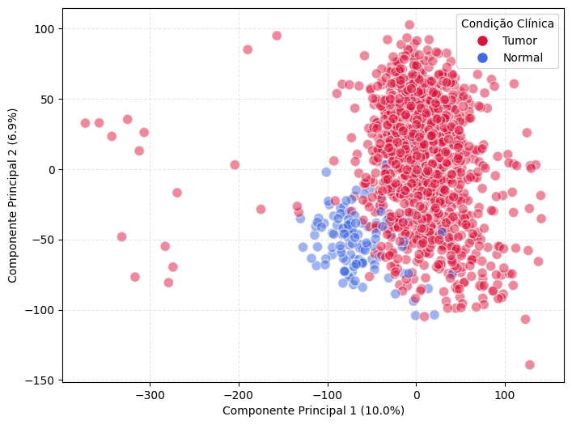
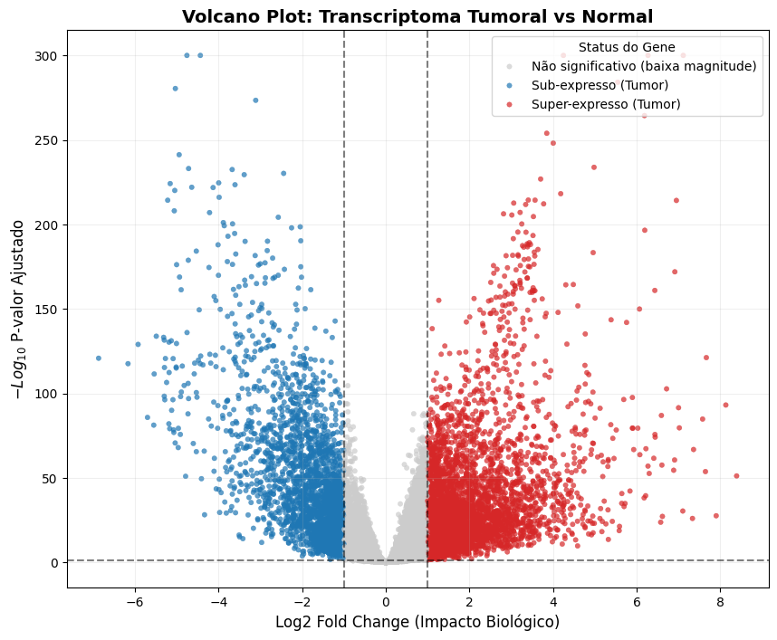
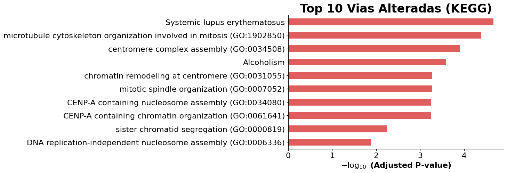

# 🧬 Análise Transcriptômica do Câncer de Mama (TCGA-BRCA)

Pipeline de bioinformática em Python para identificar genes diferencialmente expressos e vias biológicas alteradas no câncer de mama, a partir de dados públicos de RNA-Seq do projeto **TCGA** (The Cancer Genome Atlas).


---

## Sobre o projeto

Este projeto compara o transcriptoma de tecido tumoral e tecido normal adjacente em pacientes com carcinoma de mama (BRCA), com o objetivo de responder três perguntas:

1. Quais genes estão significativamente super ou sub-expressos no tumor em relação ao tecido saudável?
2. Quais processos biológicos e vias esses genes estão associados?
3. Quais proteínas ocupam posição central na rede de interação resultante — ou seja, quais são os candidatos mais promissores a alvos terapêuticos?

O pipeline cobre o fluxo completo de uma análise de expressão diferencial: da matriz de contagens brutas até um ranking de alvos terapêuticos, passando por controle de qualidade, normalização, teste estatístico, enriquecimento funcional e análise de redes de interação proteína-proteína.

## Pipeline

O projeto é dividido em três notebooks sequenciais:

| Notebook | Etapa | O que é feito |
|---|---|---|
| [`1 - pré-processamento.ipynb`](<./1%20-%20pr%C3%A9-processamento.ipynb>) | **Pré-processamento e QC** | Reversão da normalização log2 do Xena, filtragem de genes de baixa contagem, análise exploratória (profundidade de sequenciamento, distribuição das contagens, correlação entre amostras), normalização TMM e redução de dimensionalidade (PCA) |
| [`2 - análise de expressão diferencial.ipynb`](<./2%20-%20an%C3%A1lise%20de%20express%C3%A3o%20diferencial.ipynb>) | **Expressão diferencial** | Modelagem com DESeq2 (via `pydeseq2`) comparando Tumor vs. Normal, filtragem de genes significativos e visualizações |
| [`3 - análise de enriquecimento funcional.ipynb`](<./3%20-%20an%C3%A1lise%20de%20enriquecimento%20funcional.ipynb>) | **Enriquecimento funcional e redes** | Tradução de identificadores Ensembl → símbolos gênicos, análise de super-representação em bases GO e KEGG via `gseapy`, construção da rede de interação proteína-proteína (PPI) com a API do STRING e ranking de hubs |

## Principais resultados

Com base nas 1.226 amostras do cohort TCGA-BRCA, a análise de expressão diferencial identificou:

- 🔴 **4.374 genes super-expressos** no tumor
- 🔵 **2.607 genes sub-expressos** no tumor

<p align="center">
  
  <br/>
  <em>PCA da matriz normalizada (TMM): tumor e tecido normal já se separam nos dois primeiros componentes.</em>
</p>

<p align="center">
  
  <br/>
  <em>Volcano plot do teste Tumor vs. Normal.</em>
</p>

Na análise de enriquecimento, **19 termos** permaneceram significativos após correção, dominados por processos de divisão celular e organização do centrômero — um padrão esperado para tecido tumoral, marcado por proliferação descontrolada:

<p align="center">
  
</p>

A partir das vias mais significativas, foi construída uma rede de interação proteína-proteína para identificar os hubs — proteínas mais conectadas, e por isso, candidatos mais interessantes a alvos terapêuticos:

| Proteína | Nº de conexões |
|---|---|
| CENPN | 47 |
| HJURP | 44 |
| CENPM | 43 |
| CENPI | 43 |
| PLK1 | 43 |

<p align="center">
  
  <br/>
  <em>Rede PPI das proteínas nas vias mais enriquecidas — o tamanho do nó reflete o grau de conexão.</em>
</p>

Todos esses genes/proteínas reforçam a assinatura proliferativa característica do tumor.

## Estrutura do repositório

```
cancer-BRCA/
├── 1 - pré-processamento.ipynb
├── 2 - análise de expressão diferencial.ipynb
├── 3 - análise de enriquecimento funcional.ipynb
├── datasets/
│   ├── genes_up.csv                         # Genes super-expressos no tumor
│   └── genes_down.csv                       # Genes sub-expressos no tumor
└── resultados/
    ├── resultados_finais_brca.xlsx          # Vias enriquecidas + ranking de alvos terapêuticos
    └── rede_interativa_ppi.html             # Rede PPI interativa
```

> A matriz de contagens bruta (`TCGA-BRCA.star_counts.tsv.gz`) não está incluída no repositório por tamanho — veja [Fonte dos dados](#-fonte-dos-dados) para baixá-la.

## Tecnologias e bibliotecas

- **Linguagem:** Python
- **Manipulação de dados:** pandas, numpy
- **Normalização de RNA-Seq:** rnanorm
- **Expressão diferencial:** pydeseq2
- **Redução de dimensionalidade:** scikit-learn
- **Enriquecimento funcional:** gseapy, mygene
- **Redes de interação:** STRING API, networkx, pyvis
- **Visualização:** matplotlib, seaborn

## Como reproduzir

1. Clone o repositório:
   ```bash
   git clone https://github.com/Jp-Bezerra/cancer-BRCA.git
   cd cancer-BRCA
   ```
2. Instale as dependências (cada notebook também instala as suas via `!pip install` na primeira célula):
   ```bash
   pip install pandas numpy matplotlib seaborn scikit-learn rnanorm pydeseq2 mygene gseapy networkx pyvis openpyxl
   ```
3. Baixe a matriz de contagens `TCGA-BRCA.star_counts.tsv.gz` (veja [Fonte dos dados](#-fonte-dos-dados)) e coloque em `datasets/`.
4. Ajuste os caminhos de leitura: os notebooks foram desenvolvidos no Google Colab e leem os arquivos a partir do Google Drive.
5. Execute os notebooks **em ordem**: a saída de cada etapa alimenta a próxima.

## Fonte dos dados

Os dados de contagens de RNA-Seq (STAR Counts) de pacientes com câncer de mama (BRCA) do TCGA foram obtidos através do [**UCSC Xena Browser**](https://xenabrowser.net/datapages/?cohort=TCGA%20Breast%20Cancer%20(BRCA)), cohort *GDC TCGA Breast Cancer (BRCA)*.

---

<sub>Projeto acadêmico/pessoal de bioinformática. Os resultados aqui apresentados têm fins exploratórios e educacionais, não devendo ser interpretados como validação clínica ou indicação de uso terapêutico.</sub>
